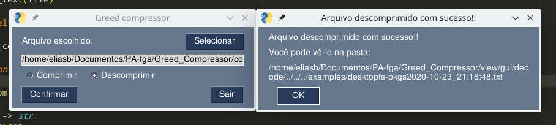

# Greed Compressor

**Conteúdo da Disciplina**: Algoritmos Ambiciosos (Greed)<br>
**Tema**: Compressão de dados

## Alunos
|Matrícula | Aluno | GitHub |
| -- | -- | -- |
| 15/0009011  |  Elias Bernardo | @ebmm01
| 17/0141161  |  Erick Giffoni | @ErickGiffoni

## Sobre 

**Greed Compressor** é um compressor de dados que funciona via execução pelo terminal/shell. <br>
Com ele você consegue comprimir um arquivo de texto no formato .txt  e gerar um arquivo binário com  <br> tamanho reduzido, bem como descomprimir um arquivo em binário (no formato .greed_compressed) <br>para voltar ao original.<br>

**Greed Compressor** funciona segundo o [algoritmo de compressão de dados de Huffman](https://en.wikipedia.org/wiki/Huffman_coding)


**Linguagem**: Python 3.8<br>
**Biblioteca(s)**: [bitstring](https://pypi.org/project/bitstring/), [pyfiglet](https://pypi.org/project/pyfiglet/0.7.5/)

### Requisitos para utilizar esse projeto

- conexão de internet;<br>
- terminal/console/shell no computador;<br>
- pip & venv
- **Python 3.8** (necessariamente)
- clonar o projeto;

> Para clonar o projeto digite:

    git clone https://github.com/projeto-de-algoritmos/Greed_Compressor.git

## Screenshots

### Versão GUI - v2.0

- Tela de sucesso ao descomprimir um arquivo



- Tela de sucesso ao comprimir um arquivo


- Tela de seleção de arquivo


### Versão Terminal - v1.0

- Menu inicial


<hr>

- Compressão de arquivo realizada


<hr>

- Descompressão de arquivo realizada


## Instalação 

Após fazer o clone do projeto, siga os passos abaixo :

- entre na raiz do projeto

>
    $ cd Greed_Compressor/

- (Opcional) Caso não possua uma venv, gere uma:

>
    $ python -m venv <nome da venv>

- (Opcional) Ative a venv caso não esteja:

> Note que o comando abaixo pode variar de acordo com o sistema operacional. Em caso de dúvidas veja a [documentação](https://docs.python.org/pt-br/dev/library/venv.html)
>
    $ source venv/bin/activate

- instale as dependências

>
    $ python -m pip install -r requirements.txt

- execute o projeto

> Para a versão GUI
>
    $ python -m view.gui.main

> Para a versão terminal:
>
    $ python -m view.terminal.main


## Uso 

### GUI - v2.0

O uso da interface é auto explicativo.

### Terminal - v1.0

- Vídeo de apresentação:
    - YouTube: [clique aqui](https://youtu.be/cgA7xKcNwN4)
    - mp4: [pasta images](./images/terminal_video.mp4)

- É necessário ter o Python 3.8

Com o projeto em execução escolha uma das opções numéricas do menu principal:

````
1 - Codificar arquivo
2 - Decodificar arquivo
0 - Sair/ Terminar execução
````
Feito isso, siga as instruções em tela.

## Problemas ? Sugestões ?

Caso você tenha alguma dificuldade, sugestão ou algum problema com o projeto,<br>
por favor entre em contato conosco:

- Elias Bernardo - ebmm01@gmail.com - telegram @ebmm01
- Erick Giffoni - giffoni.erick@gmail.com - telegram @ErickGiffoni<br>


